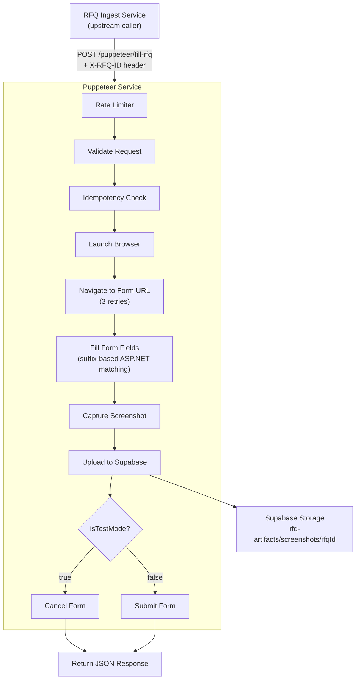
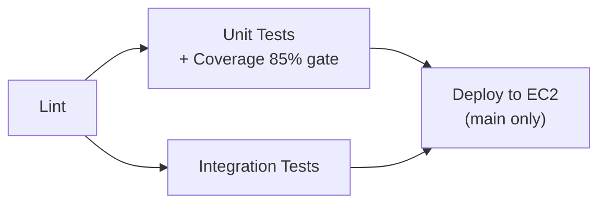

<!-- FILE: README.md -->
# Puppeteer Service

[](https://github.com/PulseInsights-Org/puppeteer-service/actions/workflows/deploy.yml)

A standalone browser automation microservice for RFQ (Request for Quote) form filling. Built with Express 5 and Puppeteer, designed for lightweight EC2 instances (T2 nano, 512 MB RAM).

---

## Table of Contents

- [Overview](#overview)
- [Tech Stack](#tech-stack)
- [Quick Start](#quick-start)
- [Architecture Summary](#architecture-summary)
- [Key Modules](#key-modules)
- [API / Interface Overview](#api--interface-overview)
- [Workflows & Jobs](#workflows--jobs)
- [Architecture Decisions](#architecture-decisions)
- [Development & Contributing](#development--contributing)
- [Deployment](#deployment)
- [Limitations / TODOs](#limitations--todos)

---

## Overview

Aviation parts suppliers receive Requests for Quote (RFQs) through web-based ASP.NET forms. Responding to each RFQ requires manually navigating to a unique form URL, filling in part availability, pricing, lead times, and other details, then submitting. This is tedious, error-prone, and time-consuming at scale.

**Puppeteer Service** solves this by automating the entire form-fill-and-submit lifecycle through headless Chrome. An upstream service (RFQ Ingest Service) parses incoming RFQ emails, extracts structured quote data, and sends it to this service via a single REST endpoint. Puppeteer Service then launches a browser, navigates to the form, fills every field using suffix-based DOM matching (tailored to ASP.NET repeater controls), captures a full-page screenshot, uploads it to Supabase Storage, and either submits the form (production mode) or cancels it (test mode).

Key capabilities:

- **ASP.NET Form Automation** -- Suffix-based field matching handles dynamically-generated element IDs from ASP.NET repeater controls.
- **Dual Mode Operation** -- `isTestMode=true` fills the form but cancels; `isTestMode=false` fills and submits. The mode is controlled by the upstream caller.
- **Idempotency** -- In-memory deduplication prevents the same RFQ from being submitted twice in production mode (24-hour TTL).
- **Screenshot Evidence** -- Full-page PNG screenshots are captured after form fill and uploaded directly to Supabase Storage, organized by RFQ ID.
- **Memory-Optimized** -- Runs in single-process Chrome mode on a 512 MB EC2 instance with configurable heap limits.

---

## Tech Stack

| Layer | Technology |
|-------|-----------|
| Runtime | Node.js >= 18 |
| HTTP Framework | Express 5.1 |
| Browser Automation | Puppeteer 24.x (bundled Chromium) |
| Screenshot Storage | Supabase Storage (`rfq-artifacts` bucket) |
| Configuration | dotenv |
| Testing | Jest 29 + Supertest 7 |
| Linting | ESLint 8 (`eslint:recommended`) |
| CI/CD | GitHub Actions |
| Process Manager | PM2 (production) |
| Reverse Proxy | Nginx + Let's Encrypt SSL (production) |
| Container | Docker (`node:18-slim`) |

---

## Quick Start

### Prerequisites

- Node.js >= 18
- A Supabase project with a storage bucket named `rfq-artifacts`

### Setup

```bash
# Clone and install
git clone https://github.com/PulseInsights-Org/puppeteer-service.git
cd puppeteer-service
npm install

# Configure environment
cp .env.example .env
# Edit .env -- set SUPABASE_URL and SUPABASE_SERVICE_ROLE_KEY

# Install pre-commit hook (optional but recommended)
npm run hooks:install
```

### Run Locally

```bash
# Development mode (non-headless browser, debug logging)
npm run dev

# Production mode
npm start

# Verify
curl http://localhost:3000/puppeteer/health
```

### Run Tests

```bash
npm test                  # Unit tests (default)
npm run test:unit         # Unit tests only
npm run test:integration  # Integration tests only
npm run test:coverage     # Unit tests + coverage report
npm run test:all          # All tests + coverage
npm run test:watch        # Watch mode
```

### Lint

```bash
npm run lint              # Check for issues
npm run lint:fix          # Auto-fix
```

---

## Architecture Summary

The service receives structured RFQ data from the RFQ Ingest Service, automates browser interaction with the target form, and stores screenshot evidence in Supabase.



---

## Key Modules

| Module | Path | Responsibility |
|--------|------|---------------|
| **Server** | `server.js` | Express entry point. Configures JSON body parsing, CORS, request logging, mounts the puppeteer router at `/puppeteer`, and handles graceful shutdown (SIGTERM/SIGINT). |
| **Router** | `src/index.js` | Defines `/health` and `/ready` endpoints, mounts the `fill-rfq` route, and registers puppeteer-specific error handlers and shutdown hooks. |
| **Fill RFQ Route** | `src/routes/fill-rfq.js` | The core POST handler. Orchestrates: request ID assignment, shutdown check, Supabase config check, request validation, idempotency check, browser launch, navigation with retry, form filling, screenshot capture/upload, and conditional submit/cancel. |
| **Browser Service** | `src/services/browser.js` | Manages Puppeteer browser lifecycle: launch (with environment-aware flags), page setup (viewport, user agent, headers, timeouts), close, and bulk shutdown of all active browsers. |
| **Form Filler** | `src/services/form-filler.js` | Provides suffix-based helpers for filling ASP.NET repeater fields: `fillRepeaterFieldBySuffix`, `selectDropdownBySuffix`, `clickElementBySuffix`, `fillTextareaBySuffix`, `fillInputBySuffix`. Also handles form submission (`submitForm`) and cancellation (`cancelFormSubmission`). |
| **Screenshot Service** | `src/services/screenshot.js` | Captures full-page PNG screenshots from Puppeteer and uploads them directly to Supabase Storage via the REST API. No local file I/O. |
| **Idempotency Service** | `src/services/idempotency.js` | In-memory Map-based deduplication. Generates composite keys from `{rfqId}:{mode}:{formUrl}`, tracks processing/completed/failed states, enforces 24-hour TTL, and runs hourly cleanup. |
| **Rate Limiter** | `src/middleware/rate-limiter.js` | Per-IP sliding window rate limiter with configurable window and max requests. Returns 429 with `Retry-After` header when exceeded. |
| **Logger** | `src/utils/logger.js` | Structured logging with level filtering. JSON output in production, human-readable in development. Levels: error, warn, info, debug. |
| **Validation** | `src/utils/validation.js` | Validates incoming RFQ request bodies (URL format, required fields, array types). Also provides `formatTagDate` to normalize dates to `MMM-DD-YYYY` format. |

---

## API / Interface Overview

### Service Discovery

| Method | Endpoint | Description |
|--------|----------|-------------|
| `GET` | `/` | Service info and available endpoints |
| `GET` | `/puppeteer/health` | Liveness probe (status, uptime, memory, version) |
| `GET` | `/puppeteer/ready` | Readiness probe (returns 503 during shutdown) |

### Form Automation

| Method | Endpoint | Description |
|--------|----------|-------------|
| `POST` | `/puppeteer/fill-rfq` | Fill and optionally submit an RFQ form |

**Required Headers:**

| Header | Required | Description |
|--------|----------|-------------|
| `Content-Type` | Yes | `application/json` |
| `X-RFQ-ID` | Yes | RFQ UUID -- used for screenshot organization and idempotency |
| `X-Request-ID` | No | Request tracking ID (auto-generated UUID if omitted) |

**Request Body (key fields):**

```json
{
  "rfq_details": {
    "quote_submission_url": "https://example.com/rfq-form"
  },
  "quote_details": {
    "items": [
      {
        "part_no": "ABC-123",
        "qty_available": "100",
        "traceability": "NEW",
        "uom": "EA",
        "price_usd": "25.00",
        "price_type": "OUTRIGHT",
        "lead_time": "5 days",
        "tag_date": "2024-01-15",
        "min_qty": 10,
        "comments": "Ready to ship",
        "no_quote": false
      }
    ],
    "supplier_comments": "Contact for bulk pricing",
    "quote_prepared_by": "John Doe"
  },
  "isTestMode": true,
  "keepOpen": false
}
```

**Response Codes:**

| Status | Condition |
|--------|-----------|
| `200` | Form filled successfully (or cached result for duplicate production requests) |
| `400` | Validation error (missing fields, invalid URL, missing X-RFQ-ID) |
| `409` | Duplicate request (already processing or concurrent race condition) |
| `429` | Rate limit exceeded (includes `Retry-After` header) |
| `503` | Supabase not configured or service shutting down |
| `500` | Browser launch failure, navigation failure, or form fill error |

**ASP.NET Field Mapping:**

| Field | Form Suffix | Type |
|-------|-------------|------|
| Quantity | `txtNEQty1` | Repeater input |
| Traceability | `ddlNETraceability1` | Dropdown |
| UOM | `txtNEUnitMeasure1` | Repeater input |
| Price | `txtNEPrice1` | Repeater input |
| Price Type | `rbOutrightNE1` / `rbExchangeNE1` | Radio button |
| Lead Time | `txtNELead1` | Repeater input |
| Tag Date | `txtNEDate1` | Repeater input (MMM-DD-YYYY) |
| Min Quantity | `txtNEMinQuantity1` | Repeater input |
| Comments | `txtNEComments1` | Repeater input |
| Supplier Comments | `txtComments` | Textarea |
| Prepared By | `quotePreparedBy` | Input |

---

## Workflows & Jobs

See [docs/workflows.md](docs/workflows.md) for detailed sequence diagrams covering:

- The complete form fill lifecycle (test mode and production mode)
- Navigation retry logic
- Idempotency state machine
- Screenshot capture and upload flow

---

## Architecture Decisions

See [docs/architecture-decisions.md](docs/architecture-decisions.md) for a reverse-engineered ADR log covering:

- Framework and runtime choices
- Suffix-based DOM matching strategy
- In-memory idempotency vs. distributed store
- Direct Supabase upload vs. local file staging
- Single-process Chrome on constrained hardware

---

## Development & Contributing

### Dev Environment Setup

```bash
npm install
cp .env.example .env
# Fill in SUPABASE_URL and SUPABASE_SERVICE_ROLE_KEY
npm run hooks:install   # Install pre-commit hook
```

### Common Commands

| Command | Purpose |
|---------|---------|
| `npm run dev` | Start with debug logging, visible browser |
| `npm test` | Run unit tests |
| `npm run test:coverage` | Unit tests + coverage enforcement (85%) |
| `npm run test:integration` | Integration tests via supertest |
| `npm run lint` | ESLint check |
| `npm run lint:fix` | ESLint auto-fix |
| `npm run change-summary` | Generate PR description with risk assessment |

### Pre-Commit Hook

Installed via `npm run hooks:install`. Runs on every `git commit`:

1. **Secret detection** -- scans staged diffs for API keys and passwords
2. **ESLint** -- lints staged `.js` files
3. **Targeted tests** -- runs `jest --findRelatedTests` for changed modules
4. **Coverage verification** -- ensures changed files meet 85% threshold

Emergency bypass: `git commit --no-verify`

### Code Style

- ESLint with `eslint:recommended` + security rules (`no-eval`, `no-implied-eval`, `no-new-func`)
- `prefer-const`, `no-var`, `eqeqeq` enforced
- `document`/`window` globals allowed in `page.evaluate()` files via ESLint override
- Unused variables with `_` prefix are allowed

### Test Structure

```
tests/
├── setup.js                           # Environment + global fixtures
├── idempotency.test.js                # Idempotency service tests
├── unit/
│   ├── validation.test.js             # Request validation + date formatting
│   ├── logger.test.js                 # Structured logging (levels, formats)
│   ├── rate-limiter.test.js           # IP-based rate limiting
│   ├── index.test.js                  # Router unit tests
│   └── services/
│       ├── browser.test.js            # Browser lifecycle (mock isolation)
│       ├── form-filler.test.js        # Form field population + DOM callback coverage
│       └── screenshot.test.js         # Capture + Supabase upload
└── integration/
    └── endpoints.test.js              # Full HTTP endpoint tests (supertest)
```

Coverage thresholds enforced by Jest (CI will fail if not met):

- Branches: 85%
- Functions: 93%
- Lines: 93%
- Statements: 93%

---

## Deployment

### CI/CD Pipeline

Defined in `.github/workflows/deploy.yml`. Triggered on push to `main`, PRs to `main`, or manual dispatch.



| Job | Runs On | Purpose |
|-----|---------|---------|
| **lint** | All triggers | ESLint across all JS files |
| **test** | After lint | Unit tests with coverage -- fails below 85% |
| **test-integration** | After lint (parallel) | HTTP endpoint tests via supertest |
| **deploy** | After both test jobs, main branch only | SSH to EC2, git pull, npm install, pm2 restart, health check |

### Production Environment

| Property | Value |
|----------|-------|
| Domain | `api.puppeteer-service.skynetparts.com` |
| Instance | EC2 (Ubuntu 24.04 LTS) |
| Process Manager | PM2 |
| Reverse Proxy | Nginx |
| SSL | Let's Encrypt (auto-renewing via Certbot) |
| App Location | `/home/ubuntu/puppeteer-service/` |

### GitHub Secrets Required

| Secret | Description |
|--------|-------------|
| `EC2_HOST` | EC2 instance IP address |
| `EC2_USER` | SSH username (e.g., `ubuntu`) |
| `EC2_SSH_KEY` | Full contents of the PEM private key |

### Docker

```bash
docker build -t puppeteer-service .
docker run -d --name puppeteer-service -p 3000:3000 \
  -e NODE_ENV=production \
  -e SUPABASE_URL=https://your-project.supabase.co \
  -e SUPABASE_SERVICE_ROLE_KEY=your-key \
  puppeteer-service
```

The Dockerfile uses `node:18-slim`, installs Chrome dependencies without recommended packages, creates a non-root `pptruser`, and includes a built-in health check.

---

## Limitations / TODOs

- **Idempotency is in-memory only.** If the process restarts, all idempotency state is lost. The code comments note that Redis should be considered for distributed deployments.
- **Single-instance architecture.** The service runs one browser at a time on a T2 nano. There is no horizontal scaling, queuing, or load balancing visible in the codebase.
- **ASP.NET-specific form matching.** The suffix-based field matching (`txtNEQty1`, `ddlNETraceability1`, etc.) is tightly coupled to a specific ASP.NET form structure. Different form vendors would require new matching logic.
- **No authentication on the API.** There is no API key, JWT, or other auth mechanism protecting the endpoints. Access control relies on network-level restrictions (CORS, security groups).
- **No retry queue.** If a form fill fails, the error is returned to the caller. There is no built-in retry queue or dead-letter mechanism.
- **CORS is permissive by default.** `CORS_ORIGIN` defaults to `*`. Production deployments should restrict this.
- **No OpenAPI/Swagger generation.** Swagger annotations exist in JSDoc comments but there is no Swagger UI or spec generation configured.
- **Rate limiter is in-memory.** Like idempotency, rate limit state resets on process restart.

---

## Project Structure

```
puppeteer-service/
├── server.js                      # Express entry point, middleware, graceful shutdown
├── package.json                   # Dependencies, scripts, engine requirements
├── jest.config.js                 # Test config with 85%+ coverage thresholds
├── .eslintrc.json                 # Linting rules (security + Puppeteer awareness)
├── .env.example                   # Environment variable template
├── .gitignore
├── Dockerfile                     # Production container (node:18-slim)
├── README.md
│
├── src/
│   ├── index.js                   # Router: /health, /ready, mounts fill-rfq
│   ├── routes/
│   │   └── fill-rfq.js            # POST handler: validation -> idempotency -> browser -> form -> screenshot
│   ├── services/
│   │   ├── browser.js             # Puppeteer lifecycle: launch, setupPage, close, shutdown
│   │   ├── form-filler.js         # ASP.NET form field helpers (suffix-based matching)
│   │   ├── screenshot.js          # Capture + direct Supabase Storage upload
│   │   └── idempotency.js         # In-memory duplicate prevention (24h TTL)
│   ├── middleware/
│   │   └── rate-limiter.js        # Per-IP rate limiting with configurable window
│   └── utils/
│       ├── logger.js              # Structured logging (JSON prod / readable dev)
│       └── validation.js          # Request schema validation + date formatter
│
├── tests/
│   ├── setup.js                   # Test environment, global fixtures
│   ├── idempotency.test.js        # Idempotency unit tests
│   ├── unit/                      # Pure unit tests (mocked dependencies)
│   └── integration/               # HTTP-level tests (supertest)
│
├── scripts/
│   ├── pre-commit                 # Git hook: secrets -> lint -> tests -> coverage
│   ├── install-hooks.sh           # Hook installer/uninstaller
│   └── change-summary.sh          # PR description generator with risk assessment
│
├── docs/
│   ├── architecture.md            # System design deep-dive
│   ├── architecture-decisions.md  # Reverse-engineered ADR log
│   ├── workflows.md               # Business and operational workflows
│   └── services/
│       └── puppeteer-service.md   # Per-service reference
│
└── .github/
    └── workflows/
        └── deploy.yml             # CI: lint -> test (85% gate) -> integration -> deploy
```

---

## License

ISC
