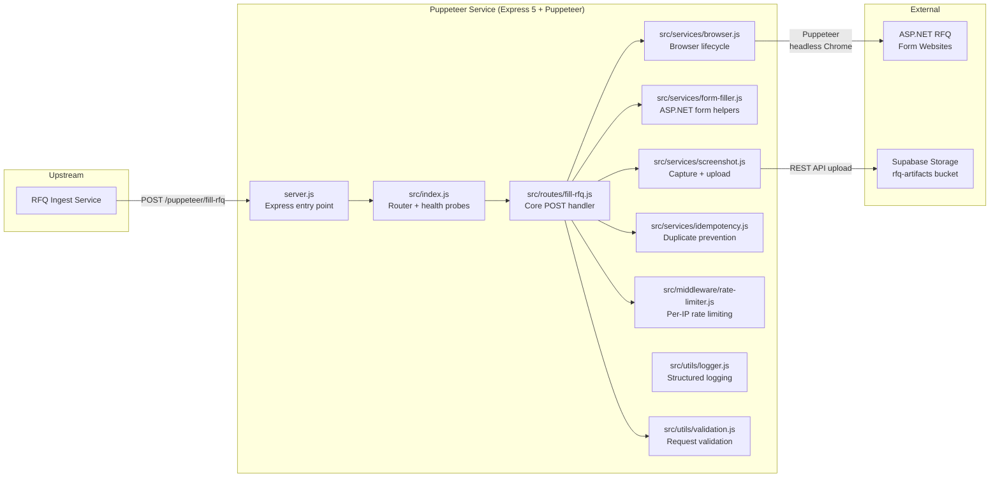
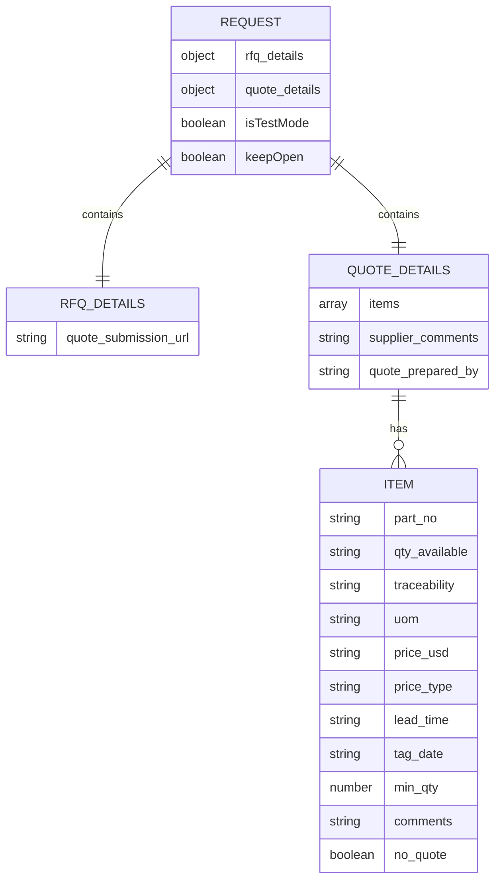
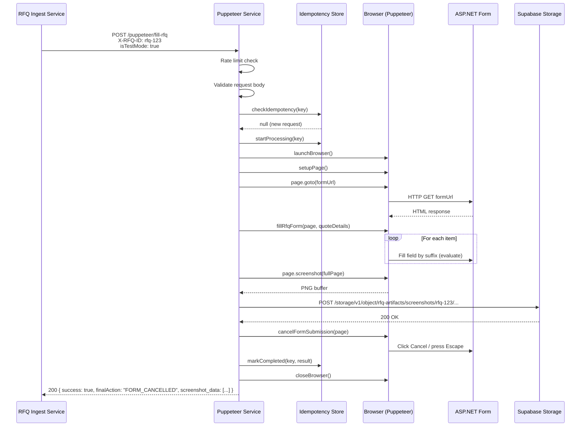
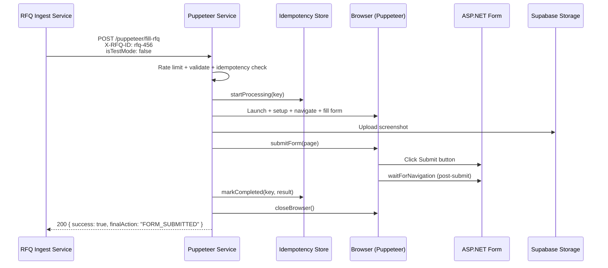
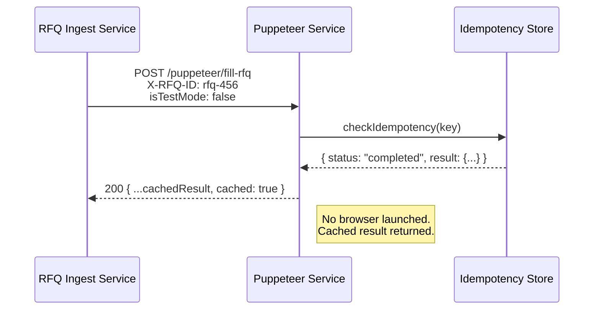
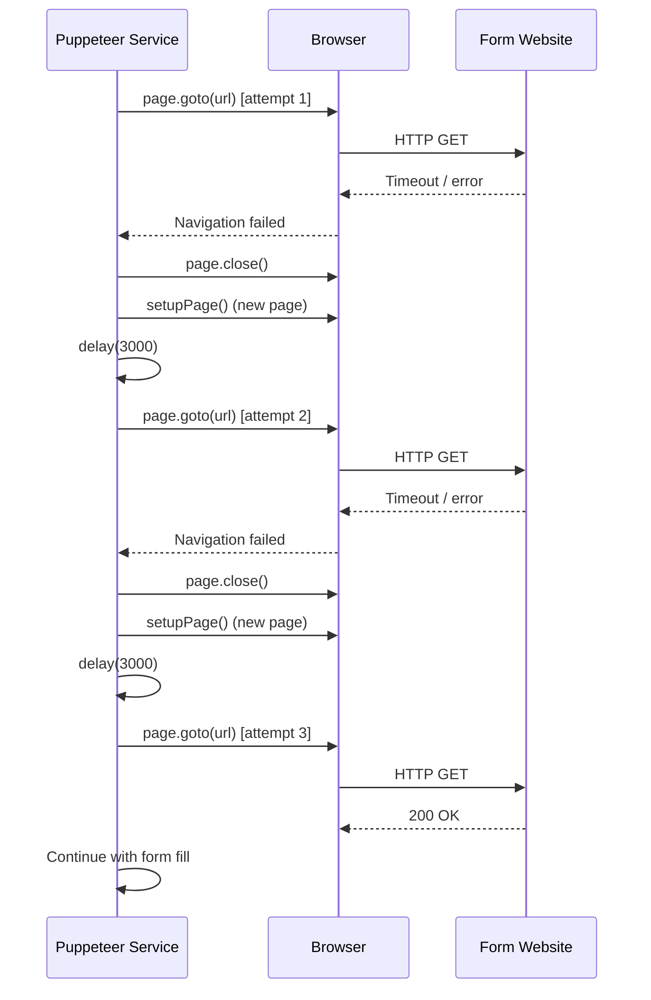

<!-- FILE: docs/architecture.md -->
# Architecture

This document provides a deep-dive into the system design of the Puppeteer Service.

---

## High-Level Architecture

The Puppeteer Service is a standalone Express.js microservice that automates RFQ (Request for Quote) form filling via headless Chrome. It sits between the RFQ Ingest Service (upstream caller) and two external systems: the target ASP.NET RFQ form websites and Supabase Storage (for screenshot evidence).

The service follows a linear request pipeline: each incoming POST request triggers a fresh browser instance, navigates to the target form, fills fields, captures a screenshot, and either submits or cancels the form based on the caller's mode flag.

### Component Summary

| Component | Type | Description |
|-----------|------|-------------|
| RFQ Ingest Service | External (upstream) | Parses RFQ emails, extracts quote data, calls Puppeteer Service |
| Express Server | Internal | HTTP entry point, CORS, request logging, error handling |
| Puppeteer Router | Internal | Health/readiness probes, route mounting, shutdown hooks |
| Fill RFQ Route | Internal | Orchestration layer for the complete form fill pipeline |
| Browser Service | Internal | Manages Chrome lifecycle (launch, page setup, close) |
| Form Filler | Internal | DOM interaction via `page.evaluate()` with suffix-based matching |
| Screenshot Service | Internal | Full-page capture + direct Supabase upload (no local I/O) |
| Idempotency Service | Internal | In-memory Map-based deduplication with 24h TTL |
| Rate Limiter | Internal | Per-IP sliding window middleware |
| ASP.NET Form | External (target) | Third-party RFQ form websites |
| Supabase Storage | External (storage) | Object storage for screenshot PNGs |

---

## Modules / Services

### server.js -- Express Entry Point

- **Responsibility:** Creates and configures the Express application. Sets up JSON body parsing (10MB limit), CORS headers, request duration logging, mounts the puppeteer router at `/puppeteer`, and provides root health check, 404 handler, and global error handler. Starts the HTTP server and registers graceful shutdown handlers for SIGTERM and SIGINT.
- **Key entrypoints:** `server.js` (the `main` field in `package.json`)
- **Dependencies:** `express`, `dotenv`, `src/index.js`, `src/utils/logger.js`

### src/index.js -- Puppeteer Router

- **Responsibility:** Defines the `/health` and `/ready` endpoints, mounts the `fill-rfq` sub-router, provides puppeteer-specific 404 and error handlers, and implements the `gracefulShutdown()` function that sets the shutting-down flag and closes all active browsers.
- **Key entrypoints:** `GET /puppeteer/health`, `GET /puppeteer/ready`, `POST /puppeteer/fill-rfq` (delegated)
- **Dependencies:** `express`, `src/services/browser.js`, `src/routes/fill-rfq.js`, `src/utils/logger.js`

### src/routes/fill-rfq.js -- Fill RFQ Route

- **Responsibility:** The core orchestration handler. Processes POST requests through a multi-stage pipeline:
  1. Rate limiting (middleware)
  2. Request ID assignment (`X-Request-ID` header or auto-generated UUID)
  3. Per-request logging (duration tracking)
  4. Shutdown check (returns 503 if shutting down)
  5. Supabase configuration check (returns 503 if not configured)
  6. `X-RFQ-ID` header validation (returns 400 if missing)
  7. Request body validation via `validateRfqRequest()`
  8. Idempotency check and processing lock
  9. Browser launch and page setup
  10. Navigation to form URL with 3-attempt retry (new page on each retry, 3-second delay between)
  11. Form filling via `fillRfqForm()`
  12. Screenshot capture and Supabase upload
  13. Conditional action: cancel (test mode) or submit (production mode)
  14. Idempotency state update (completed or failed)
  15. Browser cleanup in `finally` block
- **Key entrypoints:** `POST /` (mounted at `/puppeteer/fill-rfq`)
- **Dependencies:** All service modules, middleware, utils

### src/services/browser.js -- Browser Lifecycle

- **Responsibility:** Encapsulates all Puppeteer browser management. Launches Chrome with environment-aware flags (headless in production, visible in development; security-relaxing flags only in development). Sets up pages with 1920x1080 viewport, custom user agent (Chrome 120), HTTP headers, 2-minute default timeouts, and 5-minute protocol timeout. Tracks active browsers in a Set for graceful shutdown.
- **Key entrypoints:** `launchBrowser(requestId)`, `setupPage(browser, requestId)`, `closeBrowser(browser, requestId)`, `closeAllBrowsers()`, `setShuttingDown(value)`, `getShuttingDown()`
- **Dependencies:** `puppeteer`, `src/utils/logger.js`
- **Key constants:** `DEFAULT_TIMEOUT = 120000`, `PROTOCOL_TIMEOUT = 300000`, `VIEWPORT = { width: 1920, height: 1080 }`

### src/services/form-filler.js -- Form Field Population

- **Responsibility:** Provides a suite of helpers for interacting with ASP.NET Web Forms that use dynamically-generated element IDs. All helpers use a suffix-based matching strategy: instead of targeting exact element IDs (which vary per deployment), they filter elements by ID suffix (e.g., all `<input>` elements whose ID ends with `txtNEQty1`), then select by index to handle repeater rows.
- **Key entrypoints:**
  - `fillRfqForm(page, quoteDetails, requestId)` -- Main orchestrator; iterates items, fills fields, handles supplier comments and prepared-by
  - `cancelFormSubmission(page, requestId)` -- Finds and clicks cancel button, falls back to Escape key
  - `submitForm(page, requestId)` -- Finds and clicks submit button, waits for post-submission navigation
  - `delay(ms)` -- Promise-based delay utility
- **Internal helpers:** `fillRepeaterFieldBySuffix`, `selectDropdownBySuffix`, `clickElementBySuffix`, `fillTextareaBySuffix`, `fillInputBySuffix`
- **Dependencies:** `src/utils/logger.js`, `src/utils/validation.js` (for `formatTagDate`), `src/services/browser.js` (for `DEFAULT_TIMEOUT`)

### src/services/screenshot.js -- Screenshot Capture & Upload

- **Responsibility:** Captures full-page PNG screenshots from Puppeteer pages and uploads them directly to Supabase Storage using the REST API. No intermediate local file is written -- the screenshot buffer goes straight from Puppeteer to the Supabase upload endpoint. Validates Supabase credentials at module load time.
- **Key entrypoints:**
  - `isConfigured()` -- Returns whether Supabase credentials are set
  - `captureAndUploadScreenshot(page, rfqId, screenshotType, requestId)` -- Scrolls to top, captures, uploads
  - `uploadScreenshotToSupabase(rfqId, screenshotBuffer, screenshotType, requestId)` -- Low-level upload function
- **Dependencies:** `src/utils/logger.js`, Node.js `fetch` (built-in)
- **Storage path format:** `screenshots/{rfqId}/rfq-{screenshotType}-{timestamp}.png`
- **Supabase bucket:** `rfq-artifacts`

### src/services/idempotency.js -- Duplicate Prevention

- **Responsibility:** Prevents duplicate form submissions using an in-memory Map. Generates composite idempotency keys from `{rfqId}:{mode}:{formUrl}` where mode is `test` or `prod`. Records transition through three states: `processing` -> `completed` or `failed`. TTL is 24 hours. An hourly cleanup interval removes expired entries. The interval is `.unref()`'d so it doesn't prevent process exit.
- **Key entrypoints:** `generateIdempotencyKey()`, `checkIdempotency()`, `startProcessing()`, `markCompleted()`, `markFailed()`, `removeKey()`, `getStats()`
- **Dependencies:** `src/utils/logger.js`
- **Key constants:** `IDEMPOTENCY_TTL_MS = 86400000` (24h), `CLEANUP_INTERVAL_MS = 3600000` (1h)

### src/middleware/rate-limiter.js -- Rate Limiting

- **Responsibility:** Per-IP sliding window rate limiter. Uses an in-memory Map keyed by `puppeteer:{ip}`. Returns 429 with `Retry-After` header when the limit is exceeded. A 60-second cleanup interval removes expired entries.
- **Key entrypoints:** `rateLimit(windowMs?, maxRequests?)` -- Returns Express middleware
- **Configurable via env:** `PUPPETEER_RATE_LIMIT_WINDOW_MS` (default 60000), `PUPPETEER_RATE_LIMIT_MAX_REQUESTS` (default 10)

### src/utils/logger.js -- Structured Logging

- **Responsibility:** Provides level-filtered logging with environment-aware formatting. In production, outputs JSON with `timestamp`, `level`, `service`, `message`, and metadata. In development, outputs human-readable `[timestamp] [PUPPETEER] [LEVEL] message {meta}`.
- **Key entrypoints:** `log(level, message, meta)`, `error()`, `warn()`, `info()`, `debug()`
- **Configurable via env:** `PUPPETEER_LOG_LEVEL` (default: `info` in production, `debug` in development)

### src/utils/validation.js -- Request Validation

- **Responsibility:** Validates incoming RFQ request bodies. Checks for required `rfq_details` and `quote_details`, validates URL format (must be http/https), and checks that `items` is an array if present. Also provides `formatTagDate()` which normalizes date strings to `MMM-DD-YYYY` format (e.g., `JAN-15-2024`) for the ASP.NET form's date fields.
- **Key entrypoints:** `validateRfqRequest(body)`, `formatTagDate(value)`

---

## Data Model & Storage

This service does not use a traditional database. Data flows through the following structures:

### Request Payload (inbound)

### Idempotency Store (in-memory)

| Field | Type | Description |
|-------|------|-------------|
| `key` | `string` | `{rfqId}:{mode}:{formUrl}` |
| `status` | `string` | `processing`, `completed`, or `failed` |
| `createdAt` | `number` | Unix timestamp (ms) |
| `result` | `object\|null` | Cached success response (if completed) |
| `error` | `string\|null` | Error message (if failed) |

### Screenshot Storage (Supabase)

| Attribute | Value |
|-----------|-------|
| Bucket | `rfq-artifacts` |
| Path | `screenshots/{rfqId}/rfq-{type}-{timestamp}.png` |
| Content Type | `image/png` |
| Access | Public URL via Supabase Storage REST API |

---

## Control Flow / Key Paths

### Happy Path: Test Mode Form Fill

### Happy Path: Production Mode Form Fill

### Duplicate Production Request (Idempotency)

### Navigation Retry Flow

---

## Configuration & Environment

### Environment Variables

| Variable | Required | Default | Description |
|----------|----------|---------|-------------|
| `PORT` | No | `3000` | HTTP server port |
| `NODE_ENV` | No | `development` | `development`, `production`, or `test` |
| `SUPABASE_URL` | **Yes** | -- | Supabase project URL |
| `SUPABASE_SERVICE_ROLE_KEY` | **Yes** | -- | Supabase service role API key |
| `CORS_ORIGIN` | No | `*` | Allowed CORS origin |
| `CHROME_PATH` | No | Auto-detect | Path to Chrome/Chromium executable |
| `PUPPETEER_LOG_LEVEL` | No | `info` (prod) / `debug` (dev) | Log verbosity |
| `PUPPETEER_RATE_LIMIT_WINDOW_MS` | No | `60000` | Rate limit window in ms |
| `PUPPETEER_RATE_LIMIT_MAX_REQUESTS` | No | `10` | Max requests per window |
| `NODE_OPTIONS` | No | -- | Node.js flags (e.g., `--max-old-space-size=256`) |

### Environment Behavior Matrix

| Setting | Development | Production | Test |
|---------|-------------|------------|------|
| Browser | Visible window | Headless | Mocked |
| Logging | Debug level, human-readable | Info level, JSON | Error level only |
| Security flags | Relaxed (`disable-web-security`, `ignore-certificate-errors`) | Strict | N/A |
| Error responses | Full stack traces | Generic messages | Full details |
| Chrome path | macOS default if available | `CHROME_PATH` env or Puppeteer bundled | N/A |

### Config Files

| File | Purpose |
|------|---------|
| `.env` | Runtime environment variables (not committed) |
| `.env.example` | Template showing all available variables |
| `.eslintrc.json` | ESLint configuration with security rules and Puppeteer overrides |
| `jest.config.js` | Test runner config with coverage thresholds |

---

## Security & Auth

### API Authentication

**Not implemented.** There is no API key, JWT, or OAuth mechanism protecting the endpoints. The code relies on:

- Network-level access control (AWS security groups, VPC)
- CORS headers (configurable via `CORS_ORIGIN`, defaults to `*`)
- Rate limiting per IP address

### Supabase Authentication

The service authenticates with Supabase using a **service role key** passed via environment variables (`SUPABASE_SERVICE_ROLE_KEY`). This key is included in the `apikey` and `Authorization: Bearer` headers on every screenshot upload request. The service role key bypasses Row Level Security.

### Browser Security

- **Production:** Chrome launches with `--no-sandbox`, `--disable-setuid-sandbox`, and other hardening flags. No security-relaxing flags are applied.
- **Development:** Additional flags are added: `--ignore-certificate-errors`, `--disable-web-security`, `--disable-features=IsolateOrigins,site-per-process`. These are explicitly gated behind `NODE_ENV !== 'production'`.

### Container Security

The Dockerfile creates a non-root user (`pptruser`) and runs the application under that user. The `pptruser` is part of `audio` and `video` groups (required for Chrome).

---

## Performance & Scalability Considerations

### Explicit in Code

- **Single-process Chrome:** The `--single-process` flag is used in browser launch arguments, reducing memory overhead at the cost of stability (a crash in the renderer takes down the browser process). This is a deliberate trade-off for the 512 MB RAM constraint.
- **Memory-pressure-off flag:** Chrome's `--memory-pressure-off` flag prevents Chrome from releasing resources under memory pressure (which can cause instability on small instances).
- **Configurable heap limit:** The README documents `NODE_OPTIONS=--max-old-space-size=256` for T2 nano deployments.
- **One browser per request:** Each request launches a new browser instance and closes it in the `finally` block. There is no browser pooling or reuse.
- **Rate limiting:** 10 requests per 60-second window per IP, configurable via environment.

### Inferred

- **No horizontal scaling.** The service runs as a single PM2 process on a single EC2 instance. There is no load balancer, queue, or task distribution visible in the codebase. Throughput is limited to sequential processing of one form fill at a time (each takes tens of seconds due to browser launch + navigation + form fill + screenshot).
- **No caching** beyond idempotency result caching. Each unique request performs a full browser automation cycle.
- **No backpressure mechanism.** If the service is overwhelmed, requests either hit the rate limiter (429) or time out waiting for browser resources.
- **Memory cleanup:** The idempotency store runs hourly cleanup of expired entries. The rate limiter store runs 60-second cleanup. Both use `.unref()` to avoid preventing process exit.
