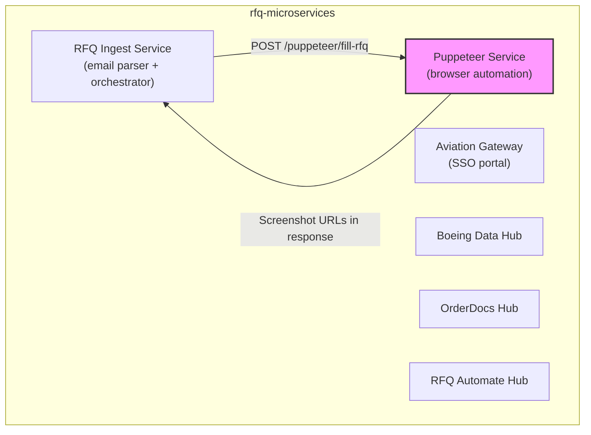

<!-- FILE: docs/services/puppeteer-service.md -->
# Puppeteer Service -- Per-Service Reference

This document provides a focused reference for the Puppeteer Service as a component within the `rfq-microservices` monorepo.

---

## Purpose & Responsibilities

The Puppeteer Service is responsible for:

1. **Automated RFQ form filling** -- Navigating to ASP.NET-based RFQ form URLs, filling in quote response data (quantities, prices, lead times, traceability, etc.), and optionally submitting the form.
2. **Screenshot evidence** -- Capturing full-page PNG screenshots of filled forms and uploading them to Supabase Storage for audit trail purposes.
3. **Duplicate prevention** -- Ensuring the same RFQ is not submitted twice in production mode via idempotency checks.
4. **Rate limiting** -- Protecting the service from abuse via per-IP rate limiting.

It does **not** handle RFQ email parsing, data extraction, user authentication, or any UI rendering. These responsibilities belong to upstream services (RFQ Ingest Service, Aviation Gateway).

---

## Tech Stack

| Component | Technology | Version |
|-----------|-----------|---------|
| Runtime | Node.js | >= 18 |
| Framework | Express | 5.1 |
| Browser Engine | Puppeteer (Chromium) | 24.x |
| Storage Client | Native `fetch` (Supabase REST API) | Built-in |
| Config | dotenv | 16.x |
| Test Runner | Jest | 29.x |
| HTTP Test Client | Supertest | 7.x |
| Linter | ESLint | 8.x |

---

## Main Entrypoints

### server.js (Application Entry)

The main process entry point. Starts the Express HTTP server on `PORT` (default 3000).

```
npm start       -> node server.js
npm run dev     -> cross-env NODE_ENV=development node server.js
```

### src/index.js (Router)

Express router mounted at `/puppeteer`. Provides:
- `GET /health` -- Liveness probe
- `GET /ready` -- Readiness probe
- Routes to `src/routes/fill-rfq.js`

### src/routes/fill-rfq.js (API Handler)

The core business logic handler:
- `POST /puppeteer/fill-rfq` -- Accepts RFQ data, automates form fill, returns results with screenshot URLs

---

## Important Endpoints / Handlers

### GET /puppeteer/health

Returns service health information including uptime, memory usage, version, and environment.

**Response (200):**
```json
{
  "status": "ok",
  "service": "puppeteer",
  "version": "1.0.0",
  "timestamp": "2024-01-01T00:00:00.000Z",
  "uptime": 3600,
  "environment": "production",
  "memory": {
    "heapUsed": 45,
    "heapTotal": 80,
    "unit": "MB"
  }
}
```

### GET /puppeteer/ready

Returns readiness status. Returns 503 during graceful shutdown to enable load balancer drain.

**Response (200):** `{ "ready": true }`
**Response (503):** `{ "ready": false, "reason": "shutting_down" }`

### POST /puppeteer/fill-rfq

The primary endpoint. See [README API Reference](../README.md#api--interface-overview) for full request/response documentation.

**Pipeline stages:**
1. Rate limiting (per-IP)
2. Request ID assignment
3. Shutdown guard
4. Supabase config validation
5. X-RFQ-ID header validation
6. Request body validation
7. Idempotency check
8. Browser launch
9. Navigation (with 3 retries)
10. Form field population
11. Screenshot capture + Supabase upload
12. Conditional submit/cancel
13. Idempotency state update
14. Browser cleanup

---

## Service Dependencies

### Internal Dependencies

| Service | Direction | Purpose |
|---------|-----------|---------|
| RFQ Ingest Service | Inbound (caller) | Sends structured RFQ data for form fill |

### External Dependencies

| Service | Direction | Purpose |
|---------|-----------|---------|
| Supabase Storage | Outbound | Screenshot upload and persistence |
| ASP.NET Form Websites | Outbound (via Puppeteer) | Target forms to be filled |
| Chrome/Chromium | Local | Browser engine managed by Puppeteer |

---

## Configuration

### Required Environment Variables

| Variable | Purpose |
|----------|---------|
| `SUPABASE_URL` | Supabase project URL for screenshot uploads |
| `SUPABASE_SERVICE_ROLE_KEY` | Authentication key for Supabase Storage API |

### Optional Environment Variables

| Variable | Default | Purpose |
|----------|---------|---------|
| `PORT` | `3000` | HTTP server port |
| `NODE_ENV` | `development` | Runtime environment |
| `CORS_ORIGIN` | `*` | CORS allowed origin |
| `CHROME_PATH` | Auto-detect | Chrome executable path |
| `PUPPETEER_LOG_LEVEL` | `info`/`debug` | Log verbosity |
| `PUPPETEER_RATE_LIMIT_WINDOW_MS` | `60000` | Rate limit window (ms) |
| `PUPPETEER_RATE_LIMIT_MAX_REQUESTS` | `10` | Max requests per window |

---

## Local Run Instructions

```bash
# From the puppeteer-service directory
cd puppeteer-service

# Install dependencies
npm install

# Copy and configure environment
cp .env.example .env
# Edit .env: set SUPABASE_URL and SUPABASE_SERVICE_ROLE_KEY

# Run in development mode (visible browser, debug logs)
npm run dev

# Run in production mode (headless, JSON logs)
npm start

# Run tests
npm test                    # Unit tests
npm run test:integration    # Integration tests
npm run test:coverage       # With coverage enforcement

# Lint
npm run lint
npm run lint:fix
```

---

## Key Internal Files

### Services

| File | Exports | Description |
|------|---------|-------------|
| `src/services/browser.js` | `launchBrowser`, `setupPage`, `closeBrowser`, `closeAllBrowsers`, `setShuttingDown`, `getShuttingDown`, `DEFAULT_TIMEOUT`, `VIEWPORT` | Chrome lifecycle management with environment-aware flags |
| `src/services/form-filler.js` | `fillRfqForm`, `cancelFormSubmission`, `submitForm`, `delay` | ASP.NET form interaction via suffix-based DOM matching |
| `src/services/screenshot.js` | `isConfigured`, `captureAndUploadScreenshot`, `uploadScreenshotToSupabase` | Screenshot capture + direct Supabase upload |
| `src/services/idempotency.js` | `generateIdempotencyKey`, `checkIdempotency`, `startProcessing`, `markCompleted`, `markFailed`, `removeKey`, `getStats` | In-memory deduplication with 24h TTL |

### Middleware

| File | Exports | Description |
|------|---------|-------------|
| `src/middleware/rate-limiter.js` | `rateLimit` | Per-IP sliding window rate limiter factory |

### Utilities

| File | Exports | Description |
|------|---------|-------------|
| `src/utils/logger.js` | `log`, `error`, `warn`, `info`, `debug` | Structured logging (JSON in prod, readable in dev) |
| `src/utils/validation.js` | `validateRfqRequest`, `formatTagDate` | Request validation + date normalization |

---

## Error Handling Summary

| Error Scenario | HTTP Status | Idempotency Effect | Browser Cleanup |
|---------------|-------------|-------------------|-----------------|
| Rate limit exceeded | 429 | No record created | No browser launched |
| Missing X-RFQ-ID | 400 | No record created | No browser launched |
| Invalid request body | 400 | No record created | No browser launched |
| Supabase not configured | 503 | No record created | No browser launched |
| Service shutting down | 503 | No record created | No browser launched |
| Duplicate (processing) | 409 | Existing record preserved | No browser launched |
| Duplicate (completed, prod) | 200 (cached) | Existing record preserved | No browser launched |
| Race condition | 409 | Existing record preserved | No browser launched |
| Browser launch failure | 500 | Marked as `failed` | No browser to close |
| Navigation failure (3 attempts) | 500 | Marked as `failed` | Browser closed |
| Form fill failure | 500 | Marked as `failed` | Browser closed |
| Screenshot upload failure | 500 | Marked as `failed` | Browser closed |
| Submit button not found (prod) | 500 | Marked as `failed` | Browser closed |
| Success (test mode) | 200 | Marked as `completed` | Browser closed |
| Success (prod mode) | 200 | Marked as `completed` | Browser closed |

---

## Monitoring & Observability

### Health Probes

- **Liveness:** `GET /puppeteer/health` -- returns 200 with memory/uptime stats
- **Readiness:** `GET /puppeteer/ready` -- returns 200 or 503 during shutdown

### Logging

All operations are logged with structured metadata including `requestId`, `rfqId`, and `isTestMode`. Key log events:

| Event | Level | Significance |
|-------|-------|-------------|
| `Execution mode received` | info | Request received with mode flag |
| `Starting form fill` | info | Browser automation beginning |
| `Navigation response` | info | Form URL loaded |
| `Page loaded successfully` | info | Navigation complete |
| `Form fill complete` | info | All fields populated |
| `Screenshot uploaded to Supabase` | info | Evidence captured |
| `FORM_CANCELLED` / `FORM_SUBMITTED` | info | Final action taken |
| `Form fill failed` | error | Automation failed |
| `Duplicate request rejected` | warn | Idempotency guard triggered |
| `Navigation attempt N failed` | warn | Retry in progress |

### Idempotency Stats

The idempotency service exposes `getStats()` which returns:
```json
{
  "totalKeys": 42,
  "processing": 1,
  "completed": 38,
  "failed": 3
}
```
This is currently not exposed via an HTTP endpoint but could be added to the health check.

---

## Relationship to Other Services



The Puppeteer Service is called exclusively by the RFQ Ingest Service. It has no dependencies on or communication with the Aviation Gateway, Boeing Data Hub, OrderDocs Hub, or RFQ Automate Hub.
