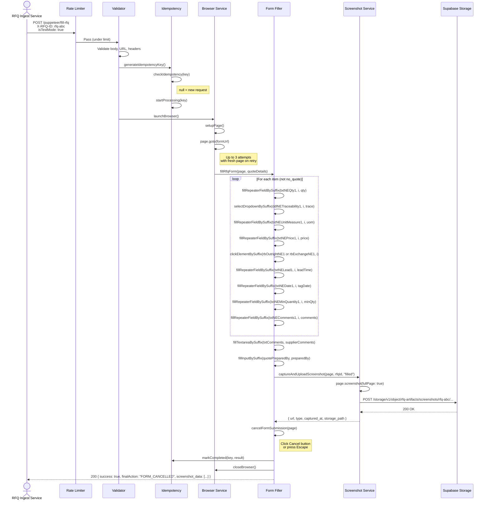
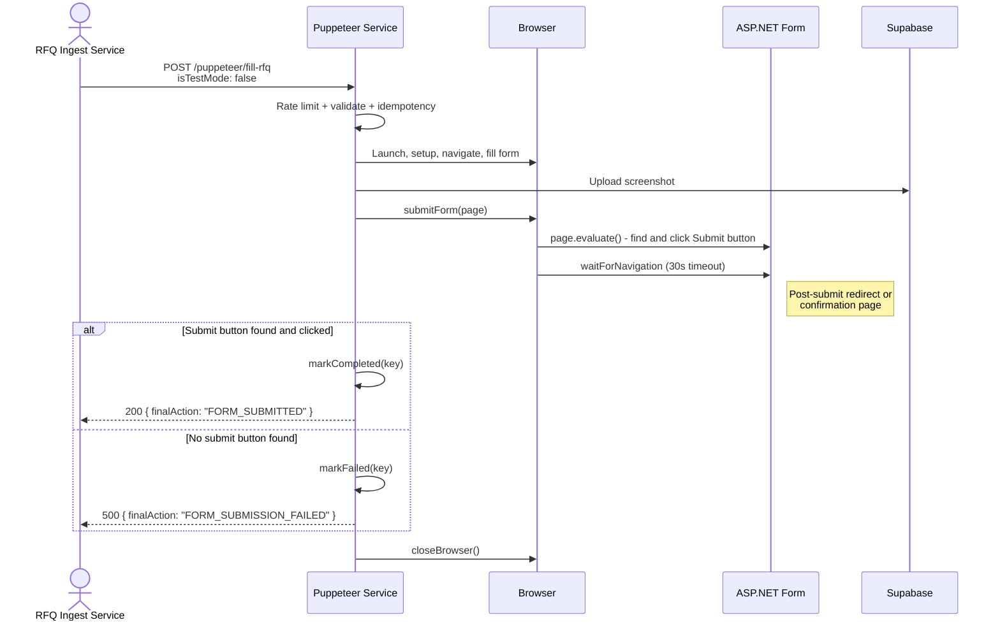
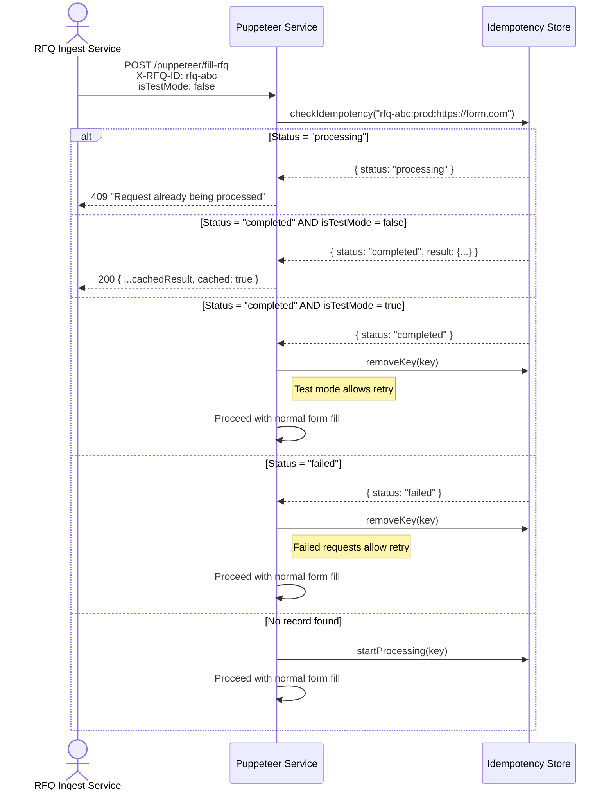
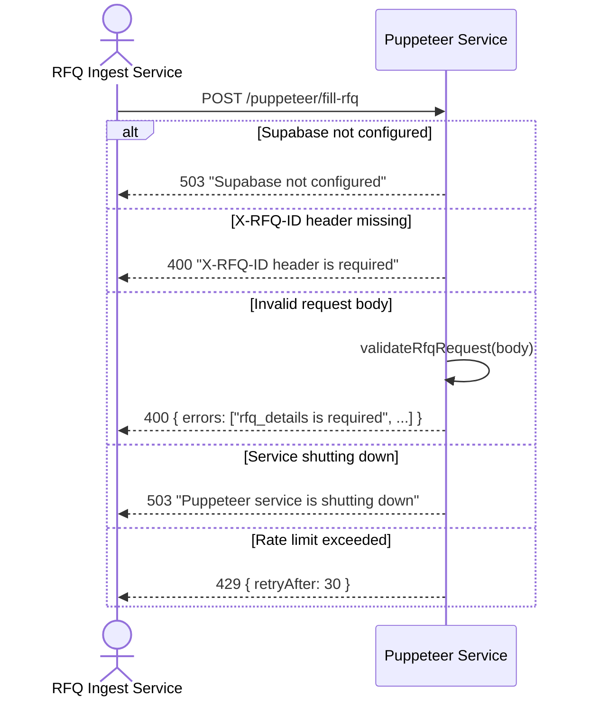
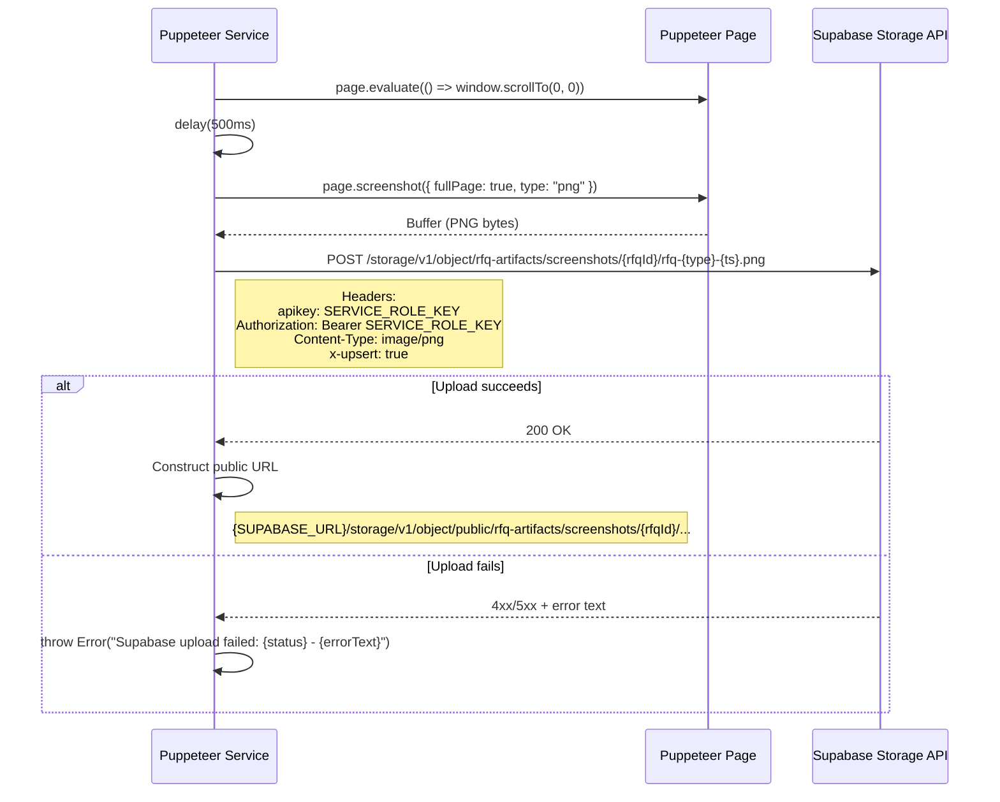
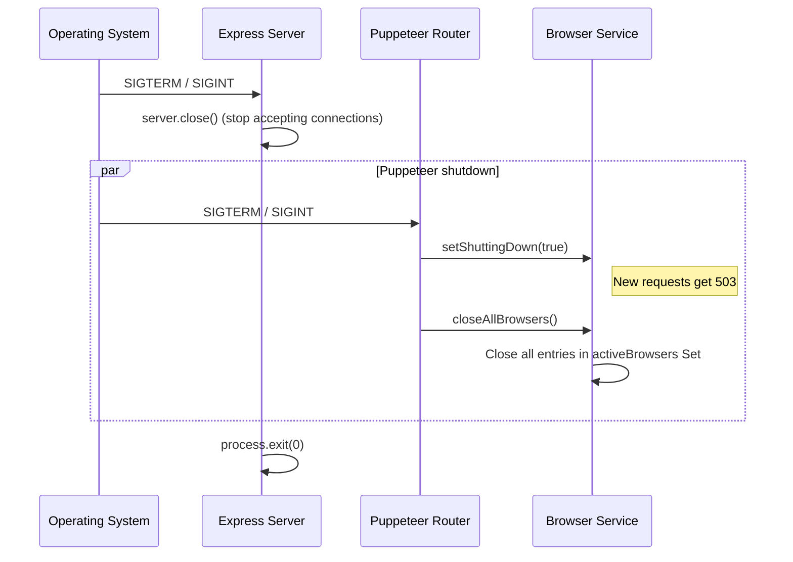

<!-- FILE: docs/workflows.md -->
# Workflows

This document describes the main operational and business workflows in the Puppeteer Service.

---

## Overview

The Puppeteer Service has one primary workflow -- **Form Fill** -- which is triggered by an HTTP POST from the upstream RFQ Ingest Service. This workflow has two variants (test mode and production mode) and several sub-workflows for error handling, idempotency, and retry logic.

There are no background jobs, cron tasks, or queue consumers. The only periodic operations are in-memory cleanup timers for the idempotency store (hourly) and rate limiter store (every 60 seconds), both running as `setInterval` with `.unref()`.

---

## User-Facing Flows

### 1. Form Fill -- Test Mode

The most common flow during development and validation. The RFQ Ingest Service sends a request with `isTestMode: true`. The form is filled but **not submitted**. A screenshot of the filled form is captured and uploaded to Supabase.

### 2. Form Fill -- Production Mode

The real submission flow. Identical to test mode except the form is **submitted** instead of cancelled.

### 3. Duplicate Request Prevention (Idempotency)

When the same RFQ + URL + mode combination is submitted again.

### 4. Request Validation Failures

---

## Background / Async Operations

### Idempotency Cleanup

- **Trigger:** `setInterval` every 1 hour (`CLEANUP_INTERVAL_MS = 3600000`)
- **Input:** In-memory idempotency store (Map)
- **Logic:** Iterates all entries, deletes any where `Date.now() - createdAt > 24h`
- **Output:** Logs count of removed entries
- **Note:** The interval is `.unref()`'d so it does not prevent Node.js process exit

### Rate Limiter Cleanup

- **Trigger:** `setInterval` every 60 seconds
- **Input:** In-memory rate limit store (Map)
- **Logic:** Iterates all entries, deletes any where `Date.now() > resetTime`
- **Output:** Silent cleanup (no logging)

---

## Integration Workflows

### Supabase Storage Integration

The service integrates with Supabase Storage for screenshot persistence. This is the only external API integration beyond browser navigation.

**Retry/Error Handling:** There is no automatic retry for Supabase uploads. A failed upload causes the entire request to fail with a 500 response. The idempotency key is marked as `failed`, allowing the caller to retry.

### Upstream Integration (RFQ Ingest Service)

The Puppeteer Service is a downstream consumer. It does not call back to the RFQ Ingest Service. The integration contract is:

| Aspect | Detail |
|--------|--------|
| Protocol | HTTP/HTTPS |
| Method | POST |
| Endpoint | `/puppeteer/fill-rfq` |
| Auth | None (network-level) |
| Required headers | `Content-Type: application/json`, `X-RFQ-ID: {uuid}` |
| Optional headers | `X-Request-ID: {uuid}` |
| Request body | JSON with `rfq_details`, `quote_details`, `isTestMode` |
| Success response | 200 with `screenshot_data` array containing Supabase URLs |
| Error response | 4xx/5xx with `error` message and `requestId` |
| Idempotency | Same `X-RFQ-ID` + URL + mode returns cached result (production) or allows retry (test/failed) |

---

## Graceful Shutdown Flow

When the service receives SIGTERM or SIGINT:

Any in-flight requests to `/puppeteer/fill-rfq` that check `getShuttingDown()` will receive a 503 response. Readiness probe (`/puppeteer/ready`) also returns 503 during shutdown.
